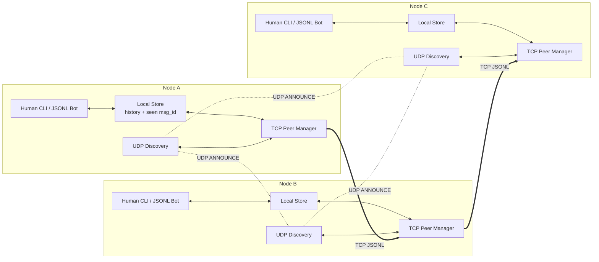
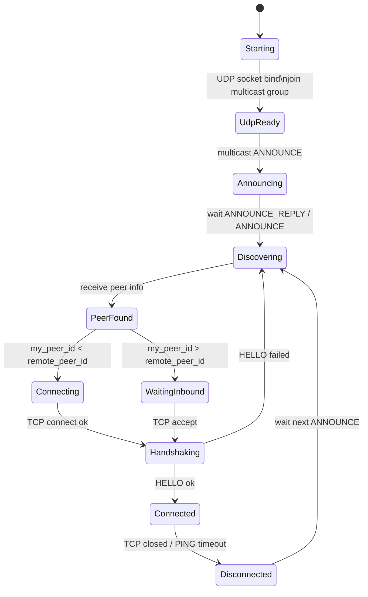
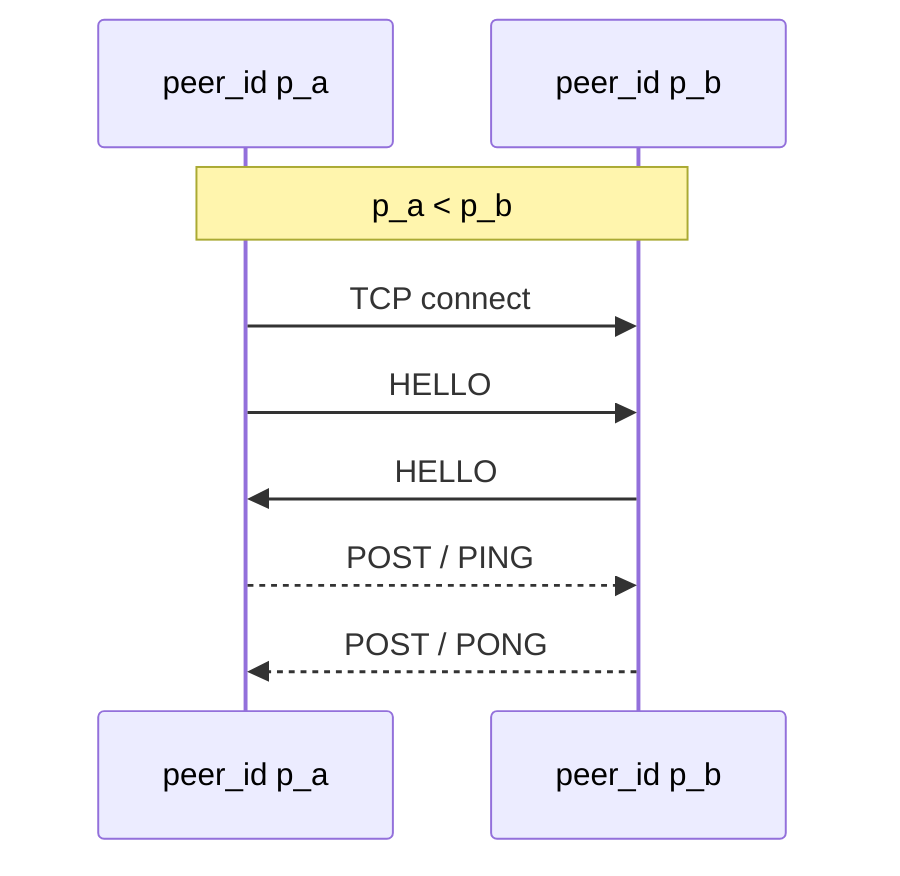
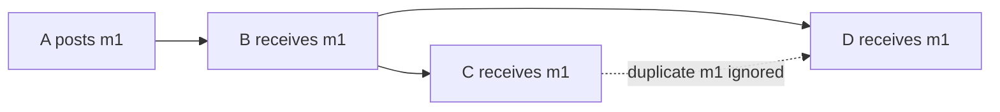
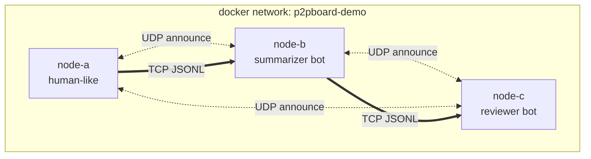

# P2PBoard Design Doc

## 1. 概要

P2PBoard は、同一 LAN または Docker Compose 上の仮想ネットワークで動作する、中央サーバ不要の P2P ホワイトボード / チャット CLI である。参加者は同じ room に参加すると互いを自動発見し、投稿を P2P gossip により共有する。人間はターミナルから利用でき、AI エージェントは JSONL 入出力を通じて同じ room に参加できる。

本アプリケーションの目的は、socket 通信、TCP/UDP、複数接続の同時処理、1 対多配送、動的なメンバー増減を、実際に動作するネットワークソフトウェアとして実装・観察することである。

## 2. 目標

- 同じ room に参加している peer を自動発見する
- 各 peer 間で TCP 接続を張りっぱなしにし、投稿を低遅延に配送する
- 中央サーバなしで POST を全参加者へ伝播する
- `msg_id` により gossip の重複配送を排除する
- 人間向け CLI と AI 向け JSONL インターフェースを両立する
- Docker Compose で複数ノードを起動し、仮想的なネットワーク越し会話を再現する
- Go で実装するが、可能な範囲で `syscall` / `golang.org/x/sys/unix` を用い、socket API に近い低レイヤの実装を行う

## 3. 非目標

- インターネット越しの NAT traversal は扱わない
- エンドツーエンド暗号化は初期実装では扱わない
- 完全な private DM は初期実装では扱わない
- 大規模 SNS ではなく、少人数 LAN / コンテナ実験用の P2P room を対象にする

## 4. 全体アーキテクチャ



通信は 2 種類に分ける。

| 種類            | プロトコル                | 用途                          |
| --------------- | ------------------------- | ----------------------------- |
| Discovery plane | UDP multicast             | room 内 peer の発見           |
| Message plane   | TCP unicast               | HELLO, POST, PING/PONG の配送 |

TCP にマルチキャストはないため、POST は接続済み peer に対して 1 本ずつ送信する。初期実装では、room 内で発見した全 peer と TCP 接続を確立する full mesh 構成を採用する。これにより POST は原則 1 hop で全 peer に届く。大規模化する場合は接続数を制限し、受信した POST を未受信 peer へ再転送する gossip 構成へ拡張できる。

## 5. Room と Peer Discovery

### 5.1 Room ID

room 名は人間向け文字列として扱い、ネットワーク上では `room_id` を使う。

```text
room_id = hex(SHA256(room_name + ":" + optional_passphrase))[0:16]
```

初期実装では passphrase なしでもよい。passphrase を使う場合、UDP announce に room 名を直接流さず、同じ合言葉を持つ参加者だけが同じ room として認識できる。

### 5.2 UDP ANNOUNCE / ANNOUNCE_REPLY

各ノードは起動後、UDP multicast group に参加し、`ANNOUNCE` を multicast する。`ANNOUNCE` を受け取った既存ノードは、新規ノードを peer table に登録し、送信元 IP と port に対して UDP unicast で `ANNOUNCE_REPLY` を返す。

これにより、新規参加ノードは既存ノードの次回定期 announce を待たずに peer table を構築できる。

```json
{
  "type": "ANNOUNCE",
  "proto": "p2pboard/0.1",
  "room_id": "r_6d7f9a1b2c3d4e5f",
  "peer_id": "p_01HXYZ...",
  "name": "yuto",
  "listen_port": 9010,
  "capabilities": ["post", "gossip", "jsonl"],
  "timestamp": 1783260000
}
```

`ANNOUNCE_REPLY` も同じ peer 情報を持つが、`type` だけが異なる。

```json
{
  "type": "ANNOUNCE_REPLY",
  "proto": "p2pboard/0.1",
  "room_id": "r_6d7f9a1b2c3d4e5f",
  "peer_id": "p_01HABC...",
  "name": "reviewer",
  "listen_port": 9010,
  "capabilities": ["post", "gossip", "jsonl"],
  "timestamp": 1783260001
}
```

受信側は以下を確認する。

1. `proto` が一致する
2. `room_id` が自分の room と一致する
3. `peer_id` が自分自身ではない
4. 送信元 IP と `listen_port` から接続先を作れる

peer を発見したら peer table に登録する。

| peer_id | name | addr                | last_seen | status     |
| ------- | ---- | ------------------- | --------- | ---------- |
| `p_a`   | yuto | `192.168.10.2:9010` | now       | connected  |
| `p_b`   | bot  | `192.168.10.3:9010` | now       | connecting |

### 5.3 Discovery 状態遷移

参加時の状態遷移は以下の通りである。



`ANNOUNCE` は参加時だけでなく、低頻度で定期送信する。これは UDP が信頼性を持たないこと、後から参加する peer が存在すること、TCP 接続が切れた後の再発見が必要であることが理由である。

送信間隔は、起動直後は短く、安定後は長くする。

```text
startup: 0s, 0.5s, 1s, 2s
steady: 5s or 10s
peer timeout: 30s
```

## 6. TCP 接続管理

各ノードは TCP listen socket を開き、同時に発見した peer へ outbound 接続を試みる。接続は投稿ごとに張るのではなく、peer 発見後に張りっぱなしにする。

初期実装では、発見した全 peer を接続対象にする。したがって N ノードの room では最大で `N * (N - 1) / 2` 本の TCP 接続を持つ。

```text
N=3  -> 3 connections
N=5  -> 10 connections
N=10 -> 45 connections
```

本実装では 2〜5 ノード程度の LAN / Docker Compose デモを想定するため、この full mesh 構成で十分である。大規模化する場合は `--max-peers` を導入し、各ノードが接続する peer 数を制限する。

### 6.1 接続を 1 本に統一するルール

2 ノードが同時に dial すると二重接続になる。これを避けるため、`peer_id` の大小で接続方向を決める。

```text
自分の peer_id < 相手の peer_id の場合:
  自分が outbound TCP connection を張る

自分の peer_id > 相手の peer_id の場合:
  相手からの inbound TCP connection を待つ
```

これにより、任意の 2 peer 間の TCP 接続は 1 本に統一される。TCP は full-duplex なので、A から B へ張った 1 本の接続上で、B から A へも POST を送信できる。



### 6.2 HELLO

TCP 接続直後に HELLO を交換し、room と peer を確認する。

```json
{
  "type": "HELLO",
  "proto": "p2pboard/0.1",
  "room_id": "r_6d7f9a1b2c3d4e5f",
  "peer_id": "p_01HXYZ...",
  "name": "yuto"
}
```

`room_id` が違う場合は接続を閉じる。`peer_id` が peer table と矛盾する場合も接続を閉じる。

### 6.3 Keepalive

張りっぱなしの TCP 接続では peer の離脱検知が必要である。アプリケーション層で `PING` / `PONG` を定義する。

```json
{"type":"PING","timestamp":1783260000}
{"type":"PONG","timestamp":1783260001}
```

一定時間 `PONG` がなければ connection を閉じ、peer を `offline` または `disconnected` にする。UDP ANNOUNCE が再度見えたら再接続する。

## 7. 投稿配送と Gossip

### 7.1 POST

通常投稿は room 全体に共有される公開 POST である。

```json
{
  "type": "POST",
  "room_id": "r_6d7f9a1b2c3d4e5f",
  "msg_id": "m_01HYZA...",
  "from": "p_01HXYZ...",
  "name": "yuto",
  "created_at": 1783260000,
  "reply_to": null,
  "mentions": ["reviewer"],
  "body": "@reviewer UDP discovery の仕様を見てください"
}
```

`mentions` は配送範囲ではなく、通知と bot 反応条件を表す。メンション付き POST も room 全体へ gossip される。

### 7.2 Gossip ルール

初期実装では full mesh を採用するため、通常の POST は接続済みの全 peer に直接送信され、ほぼ 1 hop で全参加者へ届く。それでも、二重接続、再送、将来の部分グラフ化に備えて、受信側では gossip と同じ重複排除ルールを適用する。

受信側は次の手順を実行する。

```text
if msg_id is already seen:
    ignore
else:
    mark msg_id as seen
    save POST to local history
    display or emit JSONL event
    forward POST to all connected peers except the peer it came from
```



この方式では、トポロジが完全グラフでなくても POST が伝播する。ただし gossip は重複配送を発生させるため、`msg_id` による重複排除が必須である。

### 7.3 レイテンシの想定

full mesh の場合、POST は各 peer へ直接送られるため、配送遅延は概ね 1 hop の TCP 書き込みと受信処理で決まる。同一 Docker network や同一 LAN では、2〜5 ノード規模なら体感上ほぼ即時であり、ログ上は数 ms〜数十 ms 程度を想定する。

将来 `--max-peers` により部分グラフ化した場合、最後のノードまでの遅延は graph の直径に比例する。

```text
end-to-end latency ~= hop_count * per_hop_latency
```

その場合も `msg_id` による重複排除により、複数経路から同じ POST が届いても表示は 1 回だけになる。

## 8. CLI と AI インターフェース

### 8.1 人間向け CLI

```bash
p2pboard join final-project --name yuto
```

表示例:

```text
[room final-project] joined as yuto
[peer] reviewer found at 172.20.0.3:9010

10:31 yuto: こんにちは
10:32 reviewer: 設計を確認します

> @reviewer gossipの重複排除を見てください
```

### 8.2 AI 向け JSONL

AI エージェントやスクリプトは JSONL で room のイベントを読み取れる。

```bash
p2pboard join final-project --name codex-bot --json
```

出力例:

```json
{"event":"peer_joined","peer_id":"p_b","name":"reviewer"}
{"event":"post","msg_id":"m1","from":"yuto","mentions":["codex-bot"],"body":"@codex-bot 要約して"}
```

投稿は CLI から行う。

```bash
p2pboard post final-project --name codex-bot "要約結果です"
```

発展として、受信イベントを外部プログラムに渡す bot mode を実装する。

```bash
p2pboard bot final-project --name reviewer --exec ./agents/reviewer.sh
```

## 9. Docker Compose デモ

Docker Compose により、1 台の PC 上で複数ノードを別コンテナとして起動し、仮想的にネットワーク越しの会話を再現する。



デモで確認する内容:

- node 起動後、互いに peer として発見される
- `peer_id` の大小に従って TCP 接続が 1 本に統一される
- node-a の投稿が node-b, node-c に届く
- `@reviewer` 付き投稿に reviewer bot だけが反応する
- gossip による重複 POST が `msg_id` で破棄される
- tcpdump で UDP announce と TCP POST が観察できる

## 10. Go 実装方針

高水準な `net.Listen` / `net.Dial` だけに依存せず、可能な範囲で socket の挙動を明示する。

### 10.1 低レイヤ実装で使う候補

- `golang.org/x/sys/unix.Socket`
- `unix.Bind`
- `unix.Listen`
- `unix.Accept`
- `unix.Connect`
- `unix.Recvfrom`
- `unix.Sendto`
- `unix.SetsockoptInt`
- `unix.SetNonblock`
- `unix.Poll` または platform に応じた `epoll` / `kqueue`

Go 標準の `syscall` パッケージは古く、環境差もあるため、実装では `golang.org/x/sys/unix` を優先する。ただしレポート上では、C の socket API と対応する形で説明できる。

### 10.2 goroutine と低レイヤ socket の対応

実装は以下の役割に分ける。

```text
discovery sender:
  UDP ANNOUNCE を定期送信

discovery receiver:
  UDP ANNOUNCE を受信し peer table を更新

tcp listener:
  TCP accept し HELLO を処理

peer connection reader:
  各 TCP connection から JSONL を読み取る

peer manager:
  peer_id の大小ルールに従って connect / reconnect する

stdin/jsonl handler:
  人間または bot からの入力を POST に変換する
```

Go の goroutine は OS thread に近い並行実行単位として説明できる。一方で、socket 自体は低レイヤ API で生成・設定し、ネットワークプログラミングの内容が見えるようにする。

## 11. 障害時の挙動

| 状況                   | 挙動                                            |
| ---------------------- | ----------------------------------------------- |
| peer が突然終了        | PING/PONG timeout で切断検知                    |
| UDP announce が消える  | `last_seen` 更新が止まり peer を offline にする |
| TCP 接続が切れる       | peer table は残し、announce が見えたら再接続    |
| 同じ POST を複数回受信 | `msg_id` で破棄                                 |
| room_id が違う HELLO   | 接続を閉じる                                    |
| JSON parse error       | ERROR を返すか接続を閉じる                      |

## 12. レポートで示す評価

定量評価は必須ではないが、以下はログとして示しやすい。

- peer 発見までの時間
- POST が全 node に届くまでの時間
- gossip 転送数
- duplicate discard 数
- peer 離脱から timeout 検知までの時間

動作確認ログ例:

```text
[node-a] announce room=r1 peer=p_a
[node-b] discovered p_a at 172.20.0.2:9010
[node-a] connect p_b because p_a < p_b
[node-a] post m1: hello
[node-b] recv m1 from p_a
[node-c] recv m1 from p_b
[node-c] duplicate m1 ignored
```

## 13. 設計上のねらい

ネットワークソフトウェアとして、複数人同時接続、1 対多配送、メンバーの動的増減、IPv4 対応といった要素を実装対象とする。

P2PBoard はサーバ集中型ではなく、各 node が server と client の両方として動作する。UDP による peer discovery、TCP による複数 peer 接続、gossip による 1 対多配送、参加・離脱の検知を実装することで、これらの要素を実際に動作する形で扱う。
